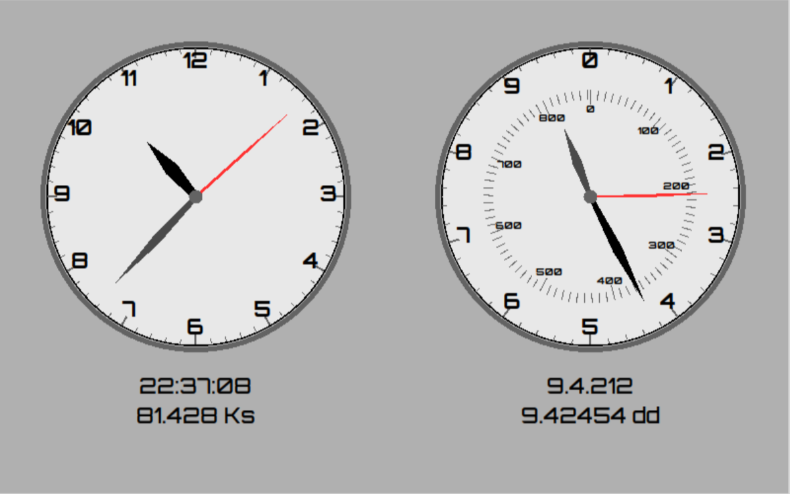

# UTMS - Universal Time Measurement System

#### 🚀 **Revolutionizing How We Measure Time**

The **Universal Time Measurement System (UTMS)** is a bold reimagining
of how humanity measures and communicates time. By leveraging the
fundamental, universal nature of **Planck time units**, this system
transcends the limitations of Earth-centric timekeeping, providing a
framework that is consistent across all observers—no matter their
location, velocity, or frame of reference in the universe.


UTMS introduces an innovative method of tracking time, spanning from
the Big Bang to the eventual heat death of the universe, based on a
decimalized time system. This reimagined timekeeping framework offers
significant advantages.


With UTMS, time measurement becomes:
- **Universal**: Accounts for relativistic effects and cosmic scales.
- **Practical**: Simplifies calculations with a decimal-based hierarchy.
- **Flexible**: Allows for multiple reference points, from the Unix epoch to your birthday.

---

#### 🌌 **The Problem with Current Timekeeping**

Traditional timekeeping systems are based on arbitrary historical and
astronomical events, such as Earth's rotation or the Gregorian
calendar. These systems:
- Lack universality: They cannot account for relativistic effects or cosmic time scales.
- Are overly complex: Using non-decimal units (e.g., 24-hour days, 60-minute hours).
- Are Earth-specific: Useless in contexts beyond our planet.

UTMS redefines time with **Planck time units**—the smallest meaningful
measurement of time—as the foundation. This universal metric is
invariant and provides a consistent reference for all observers,
regardless of relativistic effects.


---

#### 🧮 **Core Features**

1. **Planck Time Units as a Universal Metric**
   Time is measured as the total number of Planck time units since the
   Big Bang. This metric remains consistent for all observers,
   enabling communication across vastly different frames of reference.

2. **Decimal-Based Time Hierarchy**
   UTMS introduces logical, scalable time units:
   - **Kiloseconds (KSec)**: 1,000 seconds (~16.67 minutes)
   - **Megaseconds (MSec)**: 1,000,000 seconds (~11.57 days)
   - **Gigaseconds (GSec)**: 1,000,000,000 seconds (~31.7 years)
   - **Teraseconds (TSec)**: 1,000,000,000,000 seconds (~31,688 years)
   This eliminates the need for inconsistent units like hours, weeks, or months.

3. **Customizable Reference Points**
   Start measuring time relative to any point—be it the Unix epoch,
   the birth of civilization, or this very moment. The flexibility of
   UTMS accommodates both personal and scientific contexts.

4. **Earth-Centric Adaptation for Daily Life**
   Retains the concept of "days" but measures time as seconds since
   midnight, reset daily. This ensures compatibility with routines
   like work schedules while simplifying the traditional 24-hour
   format.

---

#### 🔧 **Applications**

- **Cosmic and Relativistic Communication**: Enable synchronization with observers in different inertial frames, including hypothetical relativistic aliens.
- **Scientific Research**: Provide a consistent framework for measuring time across cosmic and quantum scales.
- **Daily Usability**: Simplify everyday time tracking with decimalized, scalable units.

---

#### 🌟 **Getting Started**

This repository includes:
- A working prototype for calculating time in UTMS units.
- Conversion tools between traditional and UTMS units.
- Examples of how to use UTMS for historical and scientific events.

---

#### 💡 **Future Enhancements**

- Integration with Earth's rotation and celestial mechanics for local adaptability.
- Support for prehistoric and cosmic event timelines.
- Improved tools for visualization and human-centric usability.

---

#### 🤝 **Contribute**

Join us in redefining time!
If you have ideas, suggestions, or code to contribute, feel free to open an issue or submit a pull request.

## Steps to Get Started

### Install UTMS

Make sure [you have pip installed](https://pip.pypa.io/en/stable/installation/), and install UTMS from PyPi:

```bash
$ pip install utms
```

### Configure Gemini API key:

Create an Gemini API key here https://aistudio.google.com/app/apikey and configure it within UTMS:

```bash
$ utms --config set gemini.api_key YOUR_API_KEY
```

### Run UTMS


Once the API key is configured, you can run UTMS. If you want to just use the prompt simply run utms, and besides simply resolving arbitrary string to a time, it also supports several commands:

```bash
$ utms --help-prompt

Input the date you want to check. If not a standard date format, AI will be used to convert your
text into a parseable date. If your input starts with a dot (`.`) it'll be interpreted as a
command.

Available Commands:
.help
    Display this help message.

.exit
    Exit the UTMS CLI.

.debug
    Enter Python's PDB.

.clock
    Run a clock showing time both in standard units and new ones.

.timetable
    Prints a formatted table mapping standard hours/minutes to centidays/decidays and also
    Kiloseconds.

.unit [unit] [columns] [rows]
    Display a conversion table for a specific unit. The parameters are optional:
    - [unit]: The base unit for the conversion table ("s", "m", etc)
      Defaults to "s" if omitted.
    - [columns]: Number of columns before and after the base unit in
      the table. Defaults to a standard layout if omitted.
    - [rows]: Number of rows before and after the base unit in
      the table. Defaults to a standard layout if omitted.
    Examples:
        .unit s
        .unit m 5
        .unit h 3 10

.conv <value> <source_unit> [target_unit]
    Convert a value from one unit to another. The `target_unit` is optional:
    - <value>: The numerical value to be converted.
    - <source_unit>: The unit of the value to be converted.
    - [target_unit]: The desired unit to convert to. If omitted,
      defaults to a standard unit conversion.
    Examples:
        .conv 60 s m
        .conv 1 h

.config [set] <key> [value]
    Get or [set] UTMS configuration options.
    Examples:
        .config
        .config gemini.api_key
        .config set gemini_api_key
        .config set gemini_api_key ABCDE

.dconv <value>
    Convert a date time value from one unit to another.
    - <value>: The date time value to be converted in either HH:MM[:SS] or DD.CC[.SSS] format.
    Examples:
        .conv 10:05
        .conv 17:35:33
        .conv 3.2.250
        .conv 8.9

Notes:
  - Commands are case-sensitive and must begin with a period (`.`).
```

You can also use command line arguments directly to run UTMS:

```bash
$ utms --help

usage: utms [-h] [--unit [UNIT ...]] [--conv CONV [CONV ...]]
            [--dconv DCONV [DCONV ...]] [--config [CONFIG ...]] [--clock]
            [--timetable] [--help-prompt] [--version]
            [input_string]

UTMS CLI version 0.1.5

positional arguments:
  input_string          String to be resolved into time

options:
  -h, --help            show this help message and exit
  --unit [UNIT ...]     Unit conversion table
  --conv CONV [CONV ...]
                        Convert value between units
  --dconv DCONV [DCONV ...]
                        Convert day time between units
  --config [CONFIG ...]
                        Configure UTMS
  --clock               Run clock
  --timetable           Generate timetable
  --help-prompt         Prompt help message
  --version             Show UTMS version
```

#### Clocks

To show current time with analog/digital clocks in both standard and decimal times use `utms --clock` or run `.clock` command:




#### Convert units

##### Decimal/Duodecimal day times

To convert between time formats use `utms --dconv` or `.dconv` commands:

```bash
$ utms --dconv 15:30:25

6.4.529
```
```bash
$ utms --dconv 1.2.205

02:56:13
```

##### Convert arbitrary time units

Use the `.conv` command to convert between units:

```bash
$ utms --conv 5 h

Converting 5 h:
--------------------------------------------------
Planck Time (pt):        3.339e+47
Quectosecond (qs):       1.800e+34
Rontosecond (rs):        1.800e+31
Yoctosecond (ys):        1.800e+28
Zeptosecond (zs):        1.800e+25
Attosecond (as):         1.800e+22
Femtosecond (fs):        1.800e+19
Picosecond (ps):         1.800e+16
Nanosecond (ns):         1.800e+13
Microsecond (us):        1.800e+10
Millisecond (ms):        1.800e+7
Second (s):              18000
Minute (m):              300
Centiday (cd):           20.83333
Kilosecond (KS):         18
Hour (h):                5
Deciday (dd):            2.08333
Day (d):                 0.20833
Week (w):                0.02976
Megasecond (MS):         0.018
Lunar Cycle (lc):        0.00705
Month (M):               0.00694
Quarter (Q):             0.00228
Year (Y):                5.704e-4
Decade (D):              5.704e-5
Gigasecond (GS):         1.800e-5
Century (C):             5.704e-6
Millennium (Mn):         5.704e-7
Terasecond (TS):         1.800e-8
Megaannum (Ma):          5.704e-10
Petasecond (PS):         1.800e-11
Gigaannum (Ga):          5.704e-13
Age of Universe (au):    4.133e-14
Hubble Time (ht):        3.961e-14
Exasecond (ES):          1.800e-14
Teraannum (Ta):          5.704e-16
Zettasecond (ZS):        1.800e-17
Yottasecond (YS):        1.800e-20
Ronnasecond (RS):        1.800e-23
Quettasecond (QS):       1.800e-26
Galaxial Era (GE):       5.704e-124
```
```bash
$ utms --conv 1.25e7 s

Converting 1.25E+7 s:
--------------------------------------------------
Planck Time (pt):        2.319e+50
Quectosecond (qs):       1.250e+37
Rontosecond (rs):        1.250e+34
Yoctosecond (ys):        1.250e+31
Zeptosecond (zs):        1.250e+28
Attosecond (as):         1.250e+25
Femtosecond (fs):        1.250e+22
Picosecond (ps):         1.250e+19
Nanosecond (ns):         1.250e+16
Microsecond (us):        1.250e+13
Millisecond (ms):        1.250e+10
Second (s):              1.250e+7
Minute (m):              208333.33333
Centiday (cd):           14467.59259
Kilosecond (KS):         12500
Hour (h):                3472.22222
Deciday (dd):            1446.75926
Day (d):                 144.67593
Week (w):                20.66799
Megasecond (MS):         12.50000
Lunar Cycle (lc):        4.89919
Month (M):               4.82253
Quarter (Q):             1.58444
Year (Y):                0.39611
Decade (D):              0.03961
Gigasecond (GS):         0.01250
Century (C):             0.00396
Millennium (Mn):         3.961e-4
Terasecond (TS):         1.250e-5
Megaannum (Ma):          3.961e-7
Petasecond (PS):         1.250e-8
Gigaannum (Ga):          3.961e-10
Age of Universe (au):    2.870e-11
Hubble Time (ht):        2.751e-11
Exasecond (ES):          1.250e-11
Teraannum (Ta):          3.961e-13
Zettasecond (ZS):        1.250e-14
Yottasecond (YS):        1.250e-17
Ronnasecond (RS):        1.250e-20
Quettasecond (QS):       1.250e-23
Galaxial Era (GE):       3.961e-121
```
```bash
$ utms --conv 1.25e7 s h

Converting 1.25E+7 s:
--------------------------------------------------
Hour (h):                3472.22222
```


#### Look up a date

Just type the date in any format you can think of, and UTMS will try to make sense of it, first using python's dateparser, and if that fails it'll use the Gemini AI to look up any event known to the AI and get a parseable time value out of it:

```bash
$ utms today

2025-01-05 20:56:06.563600+01:00
NT: Now Time (2025-01-05)
  + 0.000 Y
  + 0.241 s
  + 0.241 s
DT: Day Time (2025-01-05 00:00:00)
  + 8 dd             7 cd             198 s            563.600 ms
  + 20 h             56 m             6 s              563.600 ms
  + 75 KS            366 s            563.600 ms
YT: Year Time (2025-01-01 00:00:00)
  + 4 d              8 dd             7 cd             198 s            563.600 ms
  + 4 d              8 dd             7 cd             198 s            563.600 ms
  + 4 d              8 dd             7 cd             198 s            563.600 ms
  + 420 KS           966 s            563.600 ms
MT: Month Time (2025-01-01 00:00:00)
  + 4 d              8 dd             7 cd             198 s            563.600 ms
  + 4 d              8 dd             7 cd             198 s            563.600 ms
  + 420 KS           966 s            563.600 ms
UT: Unix Time (1970-01-01)
  + 1736106966.564 s
  + 1 GS             736 MS           106 KS           966.564 s
  + 55 Y             5 d              12 h             13 m             52.164 s
  + 55.015 Y
CE: CE Time (1 CE)
  + 2025.015 Y
  + 2 Mn             25 Y             5 d              14 h             49 m             40.644 s
  + 63 GS            903 MS           260 KS           692.644 s
mT: Millennium Time (2000-01-01)
  + 25.016 Y
  + 25 Y             5 d              18 h             36 m             54.564 s
  + 789 MS           422 KS           166.564 s
LT: Life Time (1992-27-06)
  + 32.529 Y
  + 32 Y             193 d            1 h              55 m             32.004 s
  + 1 GS             26 MS            503 KS           766.564 s
BB: Big Bang Time (13.8e9 years ago)
  + 13800000055.015 Y
  + 13 Ga            800.000 Ma
  + 435485 TS        581 GS           640 MS           106 KS           996 s            710.163 ms
```
```bash
$ utms beginning of world war 1

1914-07-28T00:00:00+00:00

NT: Now Time (2025-01-05)
  - 110.447 Y
  - 110 Y            163 d            4 h              31 m             38.814 s
  - 3 GS             485 MS           361 KS           367.614 s
DT: Day Time (2025-01-05 00:00:00)
  - 403389 dd        5 cd             720 s            0E+3 ms
  - 968135 h         0E+3 ms
  - 3485286 KS       0E+3 ms
YT: Year Time (2025-01-01 00:00:00)
  - 40334 d          9 dd             5 cd             720 s            0E+3 ms
  - 5762 w           9 dd             5 cd             720 s            0E+3 ms
  - 1344 M           14 d             9 dd             5 cd             720 s            0E+3 ms
  - 3484 MS          940 KS           400 s            0E+3 ms
MT: Month Time (2025-01-01 00:00:00)
  - 40334 d          9 dd             5 cd             720 s            0E+3 ms
  - 5762 w           9 dd             5 cd             720 s            0E+3 ms
  - 3484 MS          940 KS           400 s            0E+3 ms
UT: Unix Time (1970-01-01)
  - 1749254400 s
  - 1 GS             749 MS           254 KS           400 s
  - 55 Y             157 d            16 h             17 m             45.600 s
  - 55.432 Y
CE: CE Time (1 CE)
  + 1914.569 Y
  + 1 Mn             914 Y            207 d            16 h             6 m              48.960 s
  + 60 GS            417 MS           899 KS           326.080 s
mT: Millennium Time (2000-01-01)
  - 85.431 Y
  - 85 Y             157 d            9 h              54 m             43.200 s
  - 2 GS             695 MS           939 KS           200 s
LT: Life Time (1992-27-06)
  - 77.918 Y
  - 77 Y             335 d            8 h              24 m             51.840 s
  - 2 GS             458 MS           857 KS           600 s
BB: Big Bang Time (13.8e9 years ago)
  + 13799999944.568 Y
  + 13 Ga            800.000 Ma
  + 435485 TS        578 GS           154 MS           745 KS           630 s            146.562 ms
```
```bash
$ utms extinction of dinosaurs

-6.6e7

NT: Now Time (2025-01-05)
  - 66002024.015 Y
  - 66 Ma            2 Mn             24 Y             5 d              12 h             13 m             59.548 s
  - 2 PS             82 TS            820 GS           992 MS           974 KS           425.612 s
DT: Day Time (2025-01-05 00:00:00)
  - 241067244548 dd  5 cd             11 s             664.184 ms
  - 578561386916 h   24 m             11 s             664.184 ms
  - 2082820992899 KS 51 s             664.184 ms
YT: Year Time (2025-01-01 00:00:00)
  - 24106724450 d    8 dd             5 cd             11 s             664.184 ms
  - 3443817778 w     4 d              8 dd             5 cd             11 s             664.184 ms
  - 803557481 M      20 d             8 dd             5 cd             11 s             664.184 ms
  - 2082820992 MS    553 KS           451 s            664.184 ms
MT: Month Time (2025-01-01 00:00:00)
  - 24106724450 d    8 dd             5 cd             11 s             664.184 ms
  - 3443817778 w     4 d              8 dd             5 cd             11 s             664.184 ms
  - 2082820992 MS    553 KS           451 s            664.184 ms
UT: Unix Time (1970-01-01)
  - 2082819256867451.664 s
  - 2 PS             82 TS            819 GS           256 MS           867 KS           451.664 s
  - 66 Ma            1 Mn             969 Y            0E-43 s
  - 66001969 Y
CE: CE Time (1 CE)
  - 65999999.000 Y
  - 65 Ma            999 Mn           998 Y            365 d            3 h              12 m             57.600 s
  - 2 PS             82 TS            757 GS           89 MS            713 KS           725.584 s
mT: Millennium Time (2000-01-01)
  - 66001998.999 Y
  - 66 Ma            1 Mn             998 Y            364 d            23 h             25 m             43.680 s
  - 2 PS             82 TS            820 GS           203 MS           552 KS           251.664 s
LT: Life Time (1992-27-06)
  - 66001991.486 Y
  - 66 Ma            1 Mn             991 Y            177 d            16 h             7 m              6.240 s
  - 2 PS             82 TS            819 GS           966 MS           470 KS           651.664 s
BB: Big Bang Time (13.8e9 years ago)
  + 13733998031 Y
  + 13 Ga            733.998 Ma
  + 433402 TS        760 GS           647 MS           132 KS           578 s            482.379 ms
```
```bash
$ utms fall of roman empire

0476-09-04T00:00:00+00:00

NT: Now Time (2025-01-05)
  - 1548.339 Y
  - 1 Mn             548 Y            123 d            21 h             43 m             27.780 s
  - 48 GS            860 MS           826 KS           979.620 s
DT: Day Time (2025-01-05 00:00:00)
  - 5655179 dd       5 cd             720 s            0E+3 ms
  - 13572431 h       0E+3 ms
  - 48860751 KS      600 s            0E+3 ms
YT: Year Time (2025-01-01 00:00:00)
  - 565513 d         9 dd             5 cd             720 s            0E+3 ms
  - 80787 w          4 d              9 dd             5 cd             720 s            0E+3 ms
  - 18850 M          13 d             9 dd             5 cd             720 s            0E+3 ms
  - 48860 MS         406 KS           0E+3 ms
MT: Month Time (2025-01-01 00:00:00)
  - 565513 d         9 dd             5 cd             720 s            0E+3 ms
  - 80787 w          4 d              9 dd             5 cd             720 s            0E+3 ms
  - 48860 MS         406 KS           0E+3 ms
UT: Unix Time (1970-01-01)
  - 47124720000 s
  - 47 GS            124 MS           720 KS           0 s
  - 1 Mn             493 Y            118 d            9 h              29 m             22.560 s
  - 1493.324 Y
CE: CE Time (1 CE)
  + 476.676 Y
  + 476 Y            246 d            22 h             55 m             12.000 s
  + 15 GS            42 MS            433 KS           726.080 s
mT: Millennium Time (2000-01-01)
  - 1523.323 Y
  - 1 Mn             523 Y            118 d            3 h              6 m              20.160 s
  - 48 GS            71 MS            404 KS           800 s
LT: Life Time (1992-27-06)
  - 1515.811 Y
  - 1 Mn             515 Y            296 d            1 h              36 m             28.800 s
  - 47 GS            834 MS           323 KS           200 s
BB: Big Bang Time (13.8e9 years ago)
  + 13799998506.676 Y
  + 13 Ga            799.999 Ma
  + 435485 TS        532 GS           779 MS           280 KS           30 s             146.562 ms
```


#### Print units conversion table

Use the `.unit` command to display a conversion table between time units:

```bash
$ utms --unit

Time Unit                Femtosecond (fs)    Picosecond (ps)     Nanosecond (ns)     Microsecond (us)    Millisecond (ms)    Second (s)          Minute (m)          Centiday (cd)       Kilosecond (KS)     Hour (h)            Deciday (dd)
-----------------------------------------------------------------------------------------------------------------------------------------------------------------------------------------------------------------------------------------------------
Planck Time (pt)         5.391e-29           5.391e-32           5.391e-35           5.391e-38           5.391e-41           5.391e-44           8.985e-46           6.240e-47           5.391e-47           1.498e-47           6.240e-48
Quectosecond (qs)        1.000e-15           1.000e-18           1.000e-21           1.000e-24           1.000e-27           1.000e-30           1.667e-32           1.157e-33           1.000e-33           2.778e-34           1.157e-34
Rontosecond (rs)         1.000e-12           1.000e-15           1.000e-18           1.000e-21           1.000e-24           1.000e-27           1.667e-29           1.157e-30           1.000e-30           2.778e-31           1.157e-31
Yoctosecond (ys)         1.000e-9            1.000e-12           1.000e-15           1.000e-18           1.000e-21           1.000e-24           1.667e-26           1.157e-27           1.000e-27           2.778e-28           1.157e-28
Zeptosecond (zs)         1.000e-6            1.000e-9            1.000e-12           1.000e-15           1.000e-18           1.000e-21           1.667e-23           1.157e-24           1.000e-24           2.778e-25           1.157e-25
Attosecond (as)          0.001               1.000e-6            1.000e-9            1.000e-12           1.000e-15           1.000e-18           1.667e-20           1.157e-21           1.000e-21           2.778e-22           1.157e-22
Femtosecond (fs)         1                   0.001               1.000e-6            1.000e-9            1.000e-12           1.000e-15           1.667e-17           1.157e-18           1.000e-18           2.778e-19           1.157e-19
Picosecond (ps)          1000                1                   0.001               1.000e-6            1.000e-9            1.000e-12           1.667e-14           1.157e-15           1.000e-15           2.778e-16           1.157e-16
Nanosecond (ns)          1000000             1000                1                   0.001               1.000e-6            1.000e-9            1.667e-11           1.157e-12           1.000e-12           2.778e-13           1.157e-13
Microsecond (us)         1.000e+9            1000000             1000                1                   0.001               1.000e-6            1.667e-8            1.157e-9            1.000e-9            2.778e-10           1.157e-10
Millisecond (ms)         1.000e+12           1.000e+9            1000000             1000                1                   0.001               1.667e-5            1.157e-6            1.000e-6            2.778e-7            1.157e-7
Second (s)               1.000e+15           1.000e+12           1.000e+9            1000000             1000                1                   0.01667             0.00116             0.001               2.778e-4            1.157e-4
Minute (m)               6.000e+16           6.000e+13           6.000e+10           6.000e+7            60000               60                  1                   0.06944             0.060               0.01667             0.00694
Centiday (cd)            8.640e+17           8.640e+14           8.640e+11           8.640e+8            864000              864                 14.40000            1                   0.864               0.240               0.100
Kilosecond (KS)          1.000e+18           1.000e+15           1.000e+12           1.000e+9            1000000             1000                16.66667            1.15741             1                   0.27778             0.11574
Hour (h)                 3.600e+18           3.600e+15           3.600e+12           3.600e+9            3600000             3600                60                  4.16667             3.60000             1                   0.41667
Deciday (dd)             8.640e+18           8.640e+15           8.640e+12           8.640e+9            8640000             8640                144                 10                  8.64000             2.40000             1
Day (d)                  8.640e+19           8.640e+16           8.640e+13           8.640e+10           8.640e+7            86400               1440                100                 86.40000            24                  10
Week (w)                 6.048e+20           6.048e+17           6.048e+14           6.048e+11           6.048e+8            604800              10080               700                 604.80000           168                 70
Megasecond (MS)          1.000e+21           1.000e+18           1.000e+15           1.000e+12           1.000e+9            1000000             16666.66667         1157.40741          1000                277.77778           115.74074
Lunar Cycle (lc)         2.551e+21           2.551e+18           2.551e+15           2.551e+12           2.551e+9            2551442.80000       42524.04667         2953.05880          2551.44280          708.73411           295.30588
Month (M)                2.592e+21           2.592e+18           2.592e+15           2.592e+12           2.592e+9            2592000             43200               3000                2592                720                 300
Quarter (Q)              7.889e+21           7.889e+18           7.889e+15           7.889e+12           7.889e+9            7889231.52000       131487.19200        9131.05500          7889.23152          2191.45320          913.10550
Year (Y)                 3.156e+22           3.156e+19           3.156e+16           3.156e+13           3.156e+10           3.156e+7            525948.76800        36524.22000         31556.92608         8765.81280          3652.42200
Decade (D)               3.156e+23           3.156e+20           3.156e+17           3.156e+14           3.156e+11           3.156e+8            5259487.68000       365242.20000        315569.26080        87658.12800         36524.22000
Gigasecond (GS)          1.000e+24           1.000e+21           1.000e+18           1.000e+15           1.000e+12           1.000e+9            1.667e+7            1157407.40741       1000000             277777.77778        115740.74074
Century (C)              3.156e+24           3.156e+21           3.156e+18           3.156e+15           3.156e+12           3.156e+9            5.259e+7            3652422.00000       3155692.60800       876581.28000        365242.20000
Millennium (Mn)          3.156e+25           3.156e+22           3.156e+19           3.156e+16           3.156e+13           3.156e+10           5.259e+8            3.652e+7            3.156e+7            8765812.80000       3652422.00000
Terasecond (TS)          1.000e+27           1.000e+24           1.000e+21           1.000e+18           1.000e+15           1.000e+12           1.667e+10           1.157e+9            1.000e+9            2.778e+8            1.157e+8
Megaannum (Ma)           3.156e+28           3.156e+25           3.156e+22           3.156e+19           3.156e+16           3.156e+13           5.259e+11           3.652e+10           3.156e+10           8.766e+9            3.652e+9
Petasecond (PS)          1.000e+30           1.000e+27           1.000e+24           1.000e+21           1.000e+18           1.000e+15           1.667e+13           1.157e+12           1.000e+12           2.778e+11           1.157e+11
Gigaannum (Ga)           3.156e+31           3.156e+28           3.156e+25           3.156e+22           3.156e+19           3.156e+16           5.259e+14           3.652e+13           3.156e+13           8.766e+12           3.652e+12
Age of Universe (au)     4.355e+32           4.355e+29           4.355e+26           4.355e+23           4.355e+20           4.355e+17           7.258e+15           5.040e+14           4.355e+14           1.210e+14           5.040e+13
Hubble Time (ht)         4.544e+32           4.544e+29           4.544e+26           4.544e+23           4.544e+20           4.544e+17           7.574e+15           5.259e+14           4.544e+14           1.262e+14           5.259e+13
Exasecond (ES)           1.000e+33           1.000e+30           1.000e+27           1.000e+24           1.000e+21           1.000e+18           1.667e+16           1.157e+15           1.000e+15           2.778e+14           1.157e+14
Teraannum (Ta)           3.156e+34           3.156e+31           3.156e+28           3.156e+25           3.156e+22           3.156e+19           5.259e+17           3.652e+16           3.156e+16           8.766e+15           3.652e+15
Zettasecond (ZS)         1.000e+36           1.000e+33           1.000e+30           1.000e+27           1.000e+24           1.000e+21           1.667e+19           1.157e+18           1.000e+18           2.778e+17           1.157e+17
Yottasecond (YS)         1.000e+39           1.000e+36           1.000e+33           1.000e+30           1.000e+27           1.000e+24           1.667e+22           1.157e+21           1.000e+21           2.778e+20           1.157e+20
Ronnasecond (RS)         1.000e+42           1.000e+39           1.000e+36           1.000e+33           1.000e+30           1.000e+27           1.667e+25           1.157e+24           1.000e+24           2.778e+23           1.157e+23
Quettasecond (QS)        1.000e+45           1.000e+42           1.000e+39           1.000e+36           1.000e+33           1.000e+30           1.667e+28           1.157e+27           1.000e+27           2.778e+26           1.157e+26
Galaxial Era (GE)        3.156e+142          3.156e+139          3.156e+136          3.156e+133          3.156e+130          3.156e+127          5.259e+125          3.652e+124          3.156e+124          8.766e+123          3.652e+123
```

If you want to only print the relevant ones, choose the unit you want to center the table to and the number of columns and rows to display inbetween:

```bash
$ utms --unit h 3 5

Error fetching NTP time: No response received from pool.ntp.org.
Time Unit                Minute (m)          Centiday (cd)       Kilosecond (KS)     Hour (h)            Deciday (dd)        Day (d)             Week (w)
---------------------------------------------------------------------------------------------------------------------------------------------------------------------
Millisecond (ms)         1.667e-5            1.157e-6            1.000e-6            2.778e-7            1.157e-7            1.157e-8            1.653e-9
Second (s)               0.01667             0.00116             0.001               2.778e-4            1.157e-4            1.157e-5            1.653e-6
Minute (m)               1                   0.06944             0.060               0.01667             0.00694             6.944e-4            9.921e-5
Centiday (cd)            14.40000            1                   0.864               0.240               0.100               0.010               0.00143
Kilosecond (KS)          16.66667            1.15741             1                   0.27778             0.11574             0.01157             0.00165
Hour (h)                 60                  4.16667             3.60000             1                   0.41667             0.04167             0.00595
Deciday (dd)             144                 10                  8.64000             2.40000             1                   0.100               0.01429
Day (d)                  1440                100                 86.40000            24                  10                  1                   0.14286
Week (w)                 10080               700                 604.80000           168                 70                  7                   1
Megasecond (MS)          16666.66667         1157.40741          1000                277.77778           115.74074           11.57407            1.65344
Lunar Cycle (lc)         42524.04667         2953.05880          2551.44280          708.73411           295.30588           29.53059            4.21866
```
