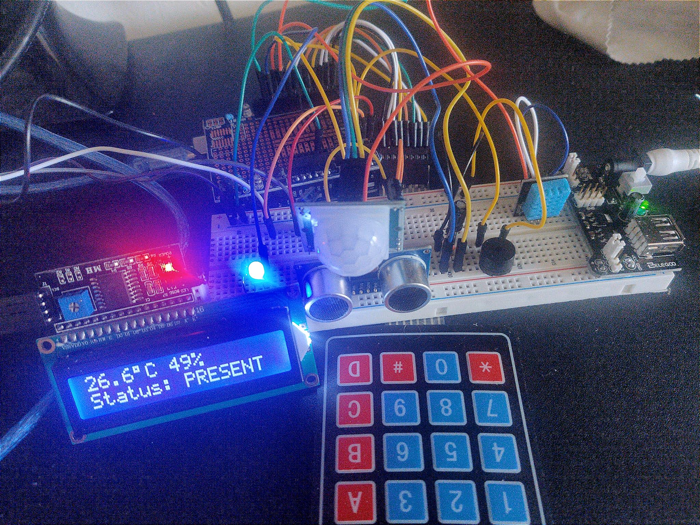

# UTMS-Core — Universal Time Modeling System

> **Programmable Time. Semantically Rich. Model-Driven.**

**UTMS-Core** is the foundation of the **Universal Time Modeling System**, a programmable framework for modeling, tracking, and reasoning about time. It allows you to define **semantic**, **relative**, and **conditionally-resolved** time entities using a Lisp-based language (**Hy**).

UTMS is not a calendar, clock, or task manager. It's a **temporal substrate**: time as programmable code.





## 🚀 What UTMS Can Do

UTMS is not just a scheduler—it’s a programmable time engine. You define *when*, *why*, and *how* things happen, and UTMS orchestrates your life accordingly. Here's what’s already possible:

| Use Case                         | Description                                                                                                                                                    |
|----------------------------------|----------------------------------------------------------------------------------------------------------------------------------------------------------------|
| ⌨️ Arduino-driven task execution  | Tap a key on your custom keypad before sleep, and UTMS tracks the event, suspends your laptop, logs the interruption, and timestamps it semantically.          |
| 🎶 Focus automation              | Start coding on a `#utms` entity, and UTMS automatically opens Emacs, starts a focus playlist in your music player, and logs duration for later review.        |
| 📚 Semantic time logging         | Log "break", "interruption", or "deep work" with one command. UTMS records exact time, context, and activation reason—without needing to predefine categories. |
| 🕸️ Chain reactions                | A single event (e.g., "wake up") can trigger a chain: stop sleep logging, start morning routine, preload calendar, run mood check-in, notify assistant agent.  |
| 🧠 Reflective feedback           | At day’s end, UTMS can auto-prompt you with reflection questions based on logged entities: "Why was your coding block interrupted at 15:04?"                   |
| ⚙️ Custom automation              | Define arbitrary behavior in Hy: "If I'm coding and it's raining, and it's before 5pm, auto-delay my walking routine and update calendar".                     |
| 🔗 Multi-modal interaction       | Use CLI, web UI, Arduino devices, or even dynamic time prompts to interact. All components sync via the same programmable time core.                           |

Every "thing" you care about in time becomes a **first-class entity**: an event, an anchor, a habit, a measurement, a phase, a condition. Each entity can store logic, activation conditions, relative timing, and HyLisp expressions.

> 🧠 “Time” in UTMS isn’t a number. It’s an intelligent, contextual fabric for living.


---

## ⚠️ Status: Experimental

- This repo contains the **core engine**, not a standalone tool.
- The CLI is legacy. UTMS is now modular: Web UI, API, hardware integrations exist in separate repositories.
- Installation is non-trivial and not documented. Intended for developers comfortable with Python, Hy, and reading source code.

---

## 🔍 What Is UTMS?

UTMS reimagines time as something you **define**, **query**, and **compose**.

Instead of tracking what happened, you model why and how things relate across time:

- "Breakfast = 30 minutes after wakeup"
- "Mark task as done if any subtasks are started"
- "Trigger reminder only if it’s not raining"

Time becomes a **semantic object graph**, not a flat schedule.

---

## 🧠 Core Concepts

### 🧱 Time Entities

UTMS models time through composable entities:
- `Task` — events with optional conditions
- `Anchor` — reference points (e.g. “sunrise”, “boot time”)
- `Variable` — dynamic or fixed data
- `Condition` — logical expressions for activation/resolution
- `Metric` — anything numeric tracked over time
- `Pattern` — recurring time blocks (e.g., Pomodoro, lunar cycles)

All are defined in **Hy**, a Lisp dialect embedded in Python. Note
that the user doesn't have to write all this code, in fact the user
should never have to write code unless they want to, all of this code
is automatically generated from the frontend.

Define a new entity type TASK:

```hy
(def-entity "TASK" entity-type
  (title {:type "string" :label "Title" :required True})
  (description {:type "string" :label "Description" :default_value ""})
  (context {:type "entity_reference" :label "Context" :reference_entity_type "context"})
  (priority {:type "integer" :label "Priority" :default_value 0})
  (status {:type "string" :label "Status" :default_value "pending"})
  (deadline {:type "datetime" :label "Deadline" :default_value None})
  (creation_date {:type "datetime" :label "Created" :default_value current-time})
  (occurrences {:type "list" :item_schema_type "OCCURRENCE"})
  (active_occurrence_start_time {:type "datetime"})
  (exclusive_resource_claims {:type "list" :item_type "string" :label "Exclusive Resource Claims" :default_value []})
  (on-start-hook {:type "code" :label "Code to run on start"})
  (on-end-hook {:type "code" :label "Code to run on end"})
)
```

Define a new TASK:
```hy
(def-task "UTMS coding"
  (active_occurrence_start_time None)
  (context (entity-ref "context" "default" "UTMS"))
  (creation_date None)
  (deadline None)
  (description None)
  (exclusive_resource_claims ["USER_PRIMARY_FOCUS"])
  (occurrences [{:start_time (datetime 2025 6 13 17 37 32 14816) :end_time (datetime 2025 6 13 17 37 36 346748) :notes "" :metadata {}}])
  (on-start-hook (do (shell "notify-send 'working on UTMS'") (shell "/home/daniel/bin/ytmusic.py" :bg True)))
  (priority 0)
  (status "")
  (title "UTMS coding")
)
```


# 🧬 Programmable Time
UTMS treats time like a data structure:
 - Relative: "15m after X", "if condition Y"
 - Composable: tasks depend on anchors, variables, sensors
 - Contextual: multiple timelines (personal, project, cosmic)
 - Meta-Temporal: models can operate over simulations or nested timelines

# 🛠️ Project Structure
```
utms-core/
├── core/            # Time engine (Hy DSL, units, formats, models)
├── cli/             # Legacy CLI (shell, commands, clock)
├── web/             # Web API + templates (FastAPI, Jinja)
├── utils/           # Display, filesystem, parsing, hy helpers
├── utms_types/      # Typed protocols and domain models
├── resources/       # Default entities, patterns, prompts
```

# 🧰 Features

| Feature                           | Status         |
|-----------------------------------|----------------|
| Hy-based time DSL                 | ✅ Stable      |
| Arbitrary time units              | ✅ Working     |
| Relative + absolute time modeling | ✅ Working     |
| Conditional activation            | ✅ Working     |
| Persistent entity storage         | ✅ Partial     |
| Web API                           | ✅ In progress |
| Web UI                            | 🟡 Early dev   |
| Arduino integration               | 🟡 Prototyped  |
| Entity macros                     | 🔜 Planned     |
| Probabilistic durations           | 🔜 Planned     |
| Multi-threaded timelines          | 🔜 Planned     |


# 📦 Installation
⚠️ Currently only usable from source. No pip/conda install.

Detailed installation instructions will be added later on.

# 🌐 Web API + UI
This repo includes a FastAPI backend.

```
python utms/web/main.py
```

Frontend development is moving to [utms-frontend](https://github.com/danielonsecurity/utms-frontend).

# 🤖 External Integrations
[utms-arduino](https://github.com/danielonsecurity/utms-arduino): LCD display, sensors, input devices

Hardware triggers: time-driven events from sensors, physical anchors

AI-assist: optional resolution help via LLMs (non-core)

# 🧭 Vision
UTMS is designed to be a universal protocol for time modeling.
It enables:

 - Personal tracking beyond schedules
 - Simulation of causal time chains
 - Emergent task activation
 - Interdisciplinary time modeling (scientific, phenomenological, project-based)

It offers a programmable substrate to build new apps, agents, devices,
and models—where time is the first-class citizen.

“Calendars are for dates.
UTMS is for everything else.”

# 🤝 Contributing
This project is pre-alpha and still evolving.

Ways to help:

- Try writing your own entities and patterns
- Help build the web UI
- Extend the plugin system
- Suggest ideas in issues
